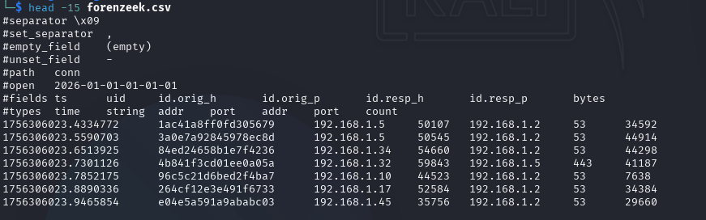
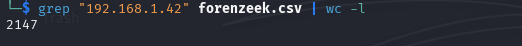
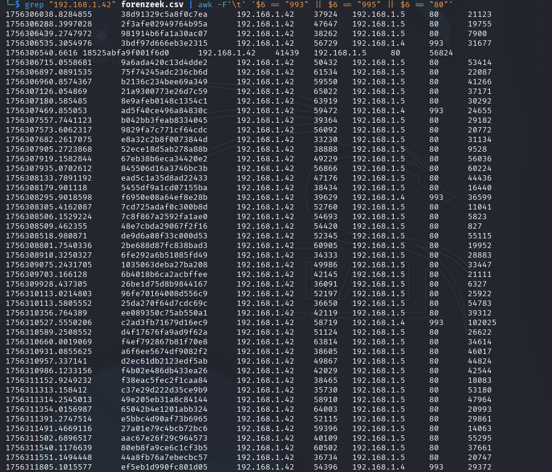
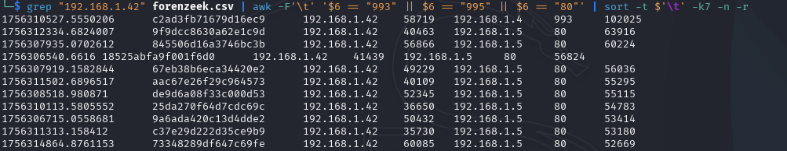
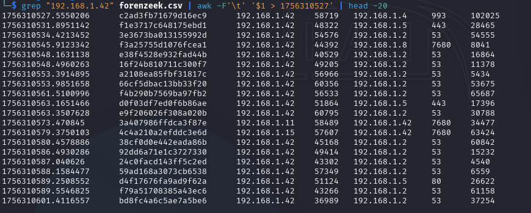
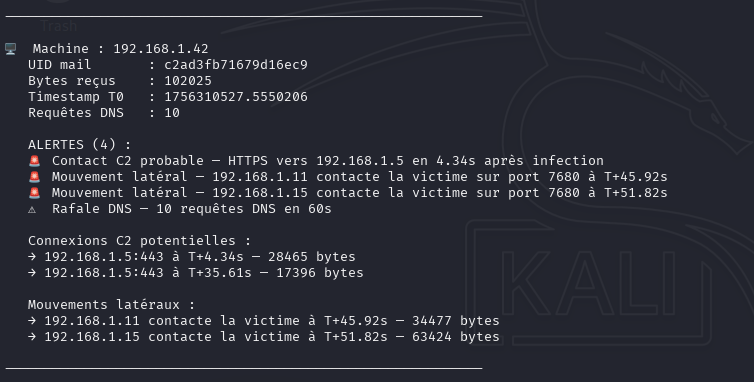

# 🐟 Forenzeek — Compromission Initiale — Write-Up

**Plateforme :** FCSC 2026  
**Catégorie :** Forensics / Réseau  
**Difficulté :** Easy  
**Date :** Avril 2026  
**Auteur :** Dryoko

---

## 📌 Contexte & Objectif

Des logs réseau issus de l'outil Zeek ont été collectés sur un réseau compromis. Une machine victime a été identifiée : `192.168.1.42`. La compromission a été réalisée via un email malveillant contenant une charge utile volumineuse.

L'objectif est de retrouver l'`uid` de la connexion associée au téléchargement de cet email malveillant.

Ce challenge simule une tâche quotidienne d'un analyste SOC Niveau 1 : l'analyse de logs réseau bruts pour identifier une compromission initiale et reconstituer une timeline d'attaque.

---

## 🧰 Outils Utilisés

| Outil | Usage |
|-------|-------|
| `grep` | Filtrage des connexions par IP victime |
| `awk` | Filtrage par colonne (port, timestamp, bytes) |
| `sort` | Tri par volume de données (bytes) |
| `date` | Conversion des timestamps Unix en heure lisible |
| Python 3 | Script d'analyse automatisée post-infection |

---

## 🔍 Analyse Pas-à-Pas

### Étape 1 — Reconnaissance du fichier

Avant toute analyse, on examine la structure du fichier Zeek :

```bash
head -15 forenzeek.csv
```

Le fichier est un `conn.log` Zeek au format TSV (~100 000 connexions) avec les champs suivants : `ts`, `uid`, `id.orig_h`, `id.orig_p`, `id.resp_h`, `id.resp_p`, `bytes`. La machine victime est `192.168.1.42`.



---

### Étape 2 — Premier filtre sur la victime

```bash
grep "192.168.1.42" forenzeek.csv | wc -l
```

> **2147 connexions** impliquent la machine victime — il faut affiner.



---

### Étape 3 — Identification des protocoles email

L'énoncé mentionne un email malveillant. On vérifie **systématiquement** les ports de réception email avant de conclure — ne jamais analyser à l'œil.

```bash
grep "192.168.1.42" forenzeek.csv | awk -F'\t' '$6 == "993" || $6 == "995" || $6 == "80"'
```

> **72 connexions** correspondent sur les ports 993 (IMAPS), 995 (POP3S) et 80 (HTTP). Aucune sur 443 contrairement à ce que l'analyse visuelle laissait supposer.

> **Leçon SOC :** Toujours vérifier les données avant de conclure sur les protocoles présents. L'analyse à l'œil nu est une source d'erreur.



---

### Étape 4 — Identification de la connexion volumineuse

On trie par volume décroissant pour isoler la connexion la plus lourde :

```bash
grep "192.168.1.42" forenzeek.csv | awk -F'\t' '$6 == "993" || $6 == "995" || $6 == "80"' | sort -t $'\t' -k7 -n -r
```

> **Une seule connexion dépasse les 100 000 bytes :**

```
1756310527.5550206  c2ad3fb71679d16ec9  192.168.1.42  58719  192.168.1.4  993  102025
```

| Champ | Valeur | Interprétation |
|-------|--------|----------------|
| IP source | `192.168.1.42` | ✅ Machine victime |
| Port destination | `993` | ✅ IMAPS — réception mail chiffrée |
| Bytes | `102 025` | ✅ Charge volumineuse — seule connexion > 100 KB |
| Serveur mail | `192.168.1.4` | ✅ Serveur mail interne |



---

### Étape 5 — Analyse comportementale post-infection

**Commande pivot du challenge :**

```bash
grep "192.168.1.42" forenzeek.csv | awk -F'\t' '$1 > 1756310527' | head -20
```

Cette commande crée une **fenêtre temporelle post-infection** en filtrant toutes les connexions postérieures au timestamp T0. Deux lignes sautent immédiatement aux yeux :

```
1756310573.470845   3a407986ffdca3f87e   192.168.1.11   58489   192.168.1.42   7680   34477
1756310579.3750103  4c4a210a2efddc3e6d   192.168.1.15   57607   192.168.1.42   7680   63424
```

**Signal critique — Inversion du trafic :**

| Avant infection | Après infection |
|-----------------|-----------------|
| `192.168.1.42` est **source** | `192.168.1.42` devient **destination** |
| La victime initie les connexions | `192.168.1.11` et `.15` contactent la victime sur port 7680 |

> Une machine saine ne devient pas soudainement destination sur un port inhabituel (7680 — Windows Update Delivery Optimization) juste après avoir reçu un email suspect. C'est un signal de **mouvement latéral actif**.



---

### Étape 6 — Validation par script Python

La détection manuelle est confirmée par un script d'analyse automatisée qui examine le comportement de toutes les machines infectées sur une fenêtre de 60 secondes post-réception du mail (seuil bytes : 70 000).

> **Résultat pour `192.168.1.42` — 4 alertes :**

```
🚨 Contact C2 probable — HTTPS vers 192.168.1.5 en 4.34s après infection
🚨 Mouvement latéral — 192.168.1.11 contacte la victime à T+45.92s — 34477 bytes
🚨 Mouvement latéral — 192.168.1.15 contacte la victime à T+51.82s — 63424 bytes
⚠️  Rafale DNS — 10 requêtes DNS en 60s
```

Les bytes des mouvements latéraux (`34477` et `63424`) sont **identiques** entre la détection manuelle et le script — validation croisée confirmée. Le script révèle également que **11 machines** ont reçu un mail volumineux depuis `192.168.1.4`, confirmant une campagne organisée.



---

## 🚨 Indicateurs de Compromission (IOC)

| Type | Valeur | Source |
|------|--------|--------|
| IP victime | `192.168.1.42` | Énoncé |
| Serveur mail interne | `192.168.1.4` | Port 993 — conn.log |
| UID connexion mail | `c2ad3fb71679d16ec9` | conn.log |
| Volume mail | `102 025 bytes` | conn.log |
| C2 probable | `192.168.1.5` | Connexions HTTPS post-infection |
| Machine latérale 1 | `192.168.1.11` | Port 7680 à T+46s |
| Machine latérale 2 | `192.168.1.15` | Port 7680 à T+52s |

---

## 🔴 Signaux d'Alerte Identifiés

- **Charge volumineuse unique** : seul mail dépassant 100 000 bytes sur le réseau — cible prioritaire de la campagne
- **Contact C2 automatique** : connexion HTTPS vers `192.168.1.5` en 4 secondes — trop rapide pour une action humaine, exécution automatique du payload
- **Inversion du trafic** : la victime devient destination sur port 7680 à T+46s et T+52s — mouvement latéral actif
- **Rafale DNS** : 10 requêtes en 60 secondes — reconnaissance réseau post-infection
- **Campagne large** : 11 machines ont reçu un mail volumineux depuis `192.168.1.4` — attaque organisée, non opportuniste

---

## 💡 Leçons Retenues

1. **Ne jamais analyser à l'œil** : les ports présents dans les logs doivent être vérifiés par commande — l'analyse visuelle sur 100 000 lignes est une source d'erreur garantie.

2. **Les timestamps Unix sont exploitables** : `awk '$1 > timestamp'` crée une fenêtre temporelle post-infection — technique réutilisable sur tout log horodaté Zeek ou autre.

3. **Un seuil arbitraire est dangereux** : `SEUIL_BYTES = 100 000` aurait manqué 10 autres machines compromises. Croiser plusieurs signaux (bytes + comportement post-infection) vaut mieux qu'un critère unique.

4. **La commande pivot** : `grep IP | awk '$1 > T0' | head -20` est le réflexe SOC de base pour détecter un comportement anormal post-infection sur des logs réseau.

5. **Validation croisée** : détection manuelle et script automatisé qui convergent vers le même résultat — c'est la méthode qui donne confiance dans une analyse avant escalade.

---

## 🔗 Ressources Utilisées

- [Zeek Documentation](https://docs.zeek.org)
- [MITRE ATT&CK T1566.001](https://attack.mitre.org/techniques/T1566/001/) — Spearphishing Attachment
- [MITRE ATT&CK T1570](https://attack.mitre.org/techniques/T1570/) — Lateral Tool Transfer
- [MITRE ATT&CK T1071](https://attack.mitre.org/techniques/T1071/) — Application Layer Protocol (C2)

---

*Write-up réalisé dans le cadre d'une reconversion vers la cybersécurité (SOC Analyst). Toutes les analyses ont été effectuées sur Kali Linux.*
